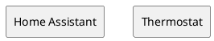

# Home Assistant

# Introduction and Goals {#section-introduction-and-goals}
The home assistant project focuses on a lightweight home automation system on a low-power esp32 base.
It provides an interface and automation points for different devices exploiting the hardware interface capabilities as described in [HW](hw.md).

In general 3 different interfaces are supported:
1. Zigbee
2. Bluetooth
3. GPIO

They are used to manage different device types:

- thermostat
- light
- door lock

## Requirements Overview {#_requirements_overview}

| ID | Description |
| -- | ----------- |
| R-Z-1 | The system shall be able to connect to Zigbee devices |
| R-Z-T-1 | The system shall be able to connect to Zigbee thermostats |
| R-Z-T-2 | The system shall be able to set a target temperature per Zigbee thermostat |
| R-T-1 | The system shall be able to map Zigbee devices to rooms |
| R-T-2 | The system shall be able to set a target temperature per room |
| R-T-3 | The system shall be able to schedule the target temperature by day of week and time of day | 

## Quality Goals {#_quality_goals}

## Stakeholders {#_stakeholders}

+-------------+---------------------------+---------------------------+
| Role/Name   | Contact                   | Expectations              |
+=============+===========================+===========================+
| *\<Role-1>* | *\<Contact-1>*            | *\<Expectation-1>*        |
+-------------+---------------------------+---------------------------+
| *\<Role-2>* | *\<Contact-2>*            | *\<Expectation-2>*        |
+-------------+---------------------------+---------------------------+

# Architecture Constraints {#section-architecture-constraints}

# Context and Scope {#section-context-and-scope}

## Business Context {#_business_context}

**\<Diagram or Table>**

**\<optionally: Explanation of external domain interfaces>**

## Technical Context {#_technical_context}

**\<Diagram or Table>**

**\<optionally: Explanation of technical interfaces>**

**\<Mapping Input/Output to Channels>**

# Solution Strategy {#section-solution-strategy}

# Building Block View {#section-building-block-view}

## Whitebox Overall System {#_whitebox_overall_system}

***\<Overview Diagram>***

Motivation

:   *\<text explanation>*

Contained Building Blocks

:   *\<Description of contained building block (black boxes)>*

Important Interfaces

:   *\<Description of important interfaces>*

### \<Name black box 1> {#__name_black_box_1}

*\<Purpose/Responsibility>*

*\<Interface(s)>*

*\<(Optional) Quality/Performance Characteristics>*

*\<(Optional) Directory/File Location>*

*\<(Optional) Fulfilled Requirements>*

*\<(optional) Open Issues/Problems/Risks>*

### \<Name black box 2> {#__name_black_box_2}

*\<black box template>*

### \<Name black box n> {#__name_black_box_n}

*\<black box template>*

### \<Name interface 1> {#__name_interface_1}

...

### \<Name interface m> {#__name_interface_m}

## Level 2 {#_level_2}

### White Box *\<building block 1>* {#_white_box_emphasis_building_block_1_emphasis}

*\<white box template>*

### White Box *\<building block 2>* {#_white_box_emphasis_building_block_2_emphasis}

*\<white box template>*

...

### White Box *\<building block m>* {#_white_box_emphasis_building_block_m_emphasis}

*\<white box template>*

## Level 3 {#_level_3}

### White Box \<\_building block x.1\_\> {#_white_box_building_block_x_1}

*\<white box template>*

### White Box \<\_building block x.2\_\> {#_white_box_building_block_x_2}

*\<white box template>*

### White Box \<\_building block y.1\_\> {#_white_box_building_block_y_1}

*\<white box template>*

# Runtime View {#section-runtime-view}

## \<Runtime Scenario 1> {#__runtime_scenario_1}

-   *\<insert runtime diagram or textual description of the scenario>*

-   *\<insert description of the notable aspects of the interactions
    between the building block instances depicted in this diagram.\>*

## \<Runtime Scenario 2> {#__runtime_scenario_2}

## ... {#_}

## \<Runtime Scenario n> {#__runtime_scenario_n}

# Deployment View {#section-deployment-view}

## Infrastructure Level 1 {#_infrastructure_level_1}

***\<Overview Diagram>***

Motivation

:   *\<explanation in text form>*

Quality and/or Performance Features

:   *\<explanation in text form>*

Mapping of Building Blocks to Infrastructure

:   *\<description of the mapping>*

## Infrastructure Level 2 {#_infrastructure_level_2}

### *\<Infrastructure Element 1>* {#__emphasis_infrastructure_element_1_emphasis}

*\<diagram + explanation>*

### *\<Infrastructure Element 2>* {#__emphasis_infrastructure_element_2_emphasis}

*\<diagram + explanation>*

...

### *\<Infrastructure Element n>* {#__emphasis_infrastructure_element_n_emphasis}

*\<diagram + explanation>*

# Cross-cutting Concepts {#section-concepts}

## *\<Concept 1>* {#__emphasis_concept_1_emphasis}

*\<explanation>*

## *\<Concept 2>* {#__emphasis_concept_2_emphasis}

*\<explanation>*

...

## *\<Concept n>* {#__emphasis_concept_n_emphasis}

*\<explanation>*

# Architecture Decisions {#section-design-decisions}

# Quality Requirements {#section-quality-scenarios}

## Quality Tree {#_quality_tree}

## Quality Scenarios {#_quality_scenarios}

# Risks and Technical Debts {#section-technical-risks}

# Glossary {#section-glossary}

+-----------------------+-----------------------------------------------+
| Term                  | Definition                                    |
+=======================+===============================================+
| *\<Term-1>*           | *\<definition-1>*                             |
+-----------------------+-----------------------------------------------+
| *\<Term-2>*           | *\<definition-2>*                             |
+-----------------------+-----------------------------------------------+

